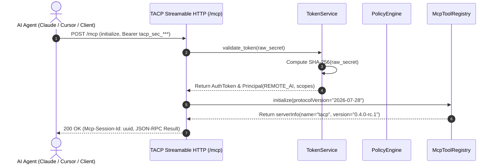
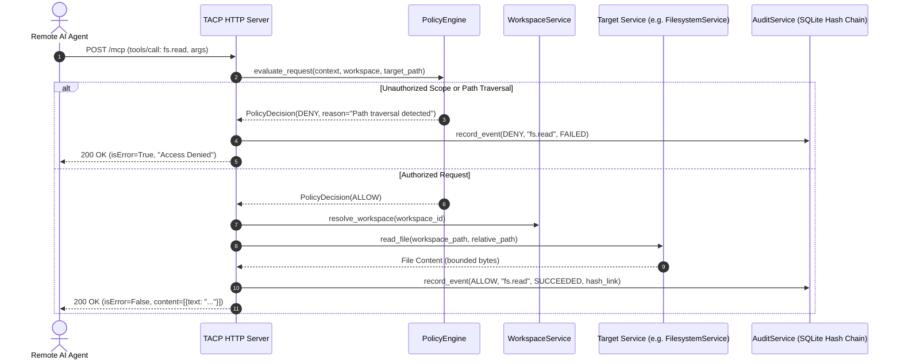
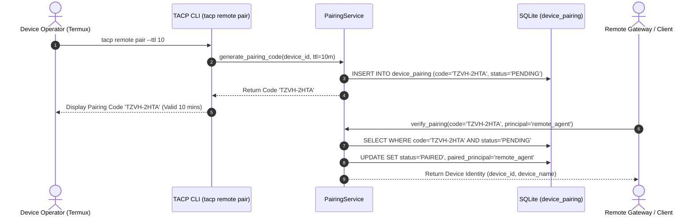

# TACP System Architecture: Universal Remote MCP Platform

## 1. Architectural Philosophy

**Termux AI Control Plane (TACP)** is designed under a singular mental model:
> **"TACP is a secure, standard-compliant Model Context Protocol (MCP) server that happens to run on Android."**

TACP is completely **agent-agnostic and vendor-neutral**. It is not a proprietary ChatGPT wrapper, Claude plugin, or vendor-locked tool. Any AI agent, development environment, or automation tool supporting the Model Context Protocol (2026-07-28 Streamable HTTP or Stdio specification) can connect to TACP as a first-class client.

```
+-----------------------------------------------------------------------------------+
|                            Remote / Local AI Clients                              |
|   Claude Desktop  |  Cursor IDE  |  VS Code  |  ChatGPT  |  Custom Agents/SDKs    |
+-----------------------------------------------------------------------------------+
                                         |
                       [Streamable HTTP / Stdio Transports]
                                         |
+-----------------------------------------------------------------------------------+
|                        TACP Access Layer (MCP Transports)                         |
|   - StreamableMcpServer (/mcp, /health, /ready, /status)                          |
|   - StdioRunner (JSON-RPC 2.0 over standard I/O)                                  |
|   - Session Tracking (Mcp-Session-Id), CORS, SSE Streaming                        |
+-----------------------------------------------------------------------------------+
                                         |
+-----------------------------------------------------------------------------------+
|                      TACP Control Layer (Governance & Auth)                       |
|   - TokenService (SHA-256 Bearer Token Verification & Scope Hierarchy)            |
|   - PairingService (Ephemeral XXXX-XXXX Device Pairing Exchange)                  |
|   - PolicyEngine (Default-Deny Invariants, Workspace Jailing, Risk Classification) |
|   - ApprovalEngine & LeaseEngine (Interactive Human Approval & Capability Leases) |
|   - AuditService (Cryptographic SHA-256 Tamper-Evident Event Chaining)            |
+-----------------------------------------------------------------------------------+
                                         |
+-----------------------------------------------------------------------------------+
|                           TACP Core Services Layer                                |
|   - WorkspaceService (Multi-root Registry, Containment, Normalization)            |
|   - FilesystemService (Jailed Read, Search, Stat, Canonical Boundaries)          |
|   - PatchService (Atomic Unified Diff Application, Rollback, Staging)            |
|   - ExecutionService (Governed Process Execution, Zero-Shell, Watchdogs)          |
|   - SystemService & CapabilityService (OS Diagnostics, Battery, Telemetry)        |
+-----------------------------------------------------------------------------------+
                                         |
+-----------------------------------------------------------------------------------+
|                        TACP Providers & Infrastructure                            |
|   - FilesystemProvider (Jailed Path Verification, Content Limits)                 |
|   - ProcessExecutor (setsid session isolation, bounded stream I/O, ANSI scrub)   |
|   - SQLite Database (WAL mode, Schema Migrations 1-8)                             |
|   - Android / Termux Host Environment (Linux 4.19+ aarch64)                       |
+-----------------------------------------------------------------------------------+
```

---

## 2. Core Subsystems

### 2.1 Access Layer (MCP Transports)
TACP implements dual transports compliant with standard MCP specifications:
1. **Streamable HTTP Transport (`/mcp`)**:
   - Primary transport for remote agents over network topologies.
   - Endpoint: `POST /mcp` (JSON-RPC dispatch) and `GET /mcp` (SSE streaming channel).
   - Probes: `GET /health` (liveness probe) and `GET /ready` (readiness probe, checking database & registered workspaces).
   - Header `Mcp-Session-Id`: Enables stateful session tracking across stateless HTTP calls.
   - HTTP 401 Unauthorized with `WWW-Authenticate: Bearer realm="TACP MCP"` when unauthenticated requests arrive.
2. **Stdio Transport**:
   - Secondary transport for local agents executing directly on the device or piped through SSH.
   - Standard newline-delimited JSON-RPC 2.0 messages over `stdin`/`stdout`.

### 2.2 Control Layer (Security & Governance)
1. **Token Authentication (`TokenService`)**:
   - Bearer tokens are cryptographically generated with format `tacp_sec_<64_hex_chars>`.
   - Raw tokens are **never stored in plaintext**; only their SHA-256 hash is persisted in the SQLite `auth_tokens` table.
   - Token Scopes:
     - `tacp.read`: Global read access across workspaces, system metrics, and audit logs.
     - `tacp.files.read`: Read-only access to files inside registered workspaces.
     - `tacp.files.write`: Mutation access (atomic patching) inside registered workspaces.
     - `tacp.system.read`: Access to OS inspection, battery, memory, and diagnostics.
     - `tacp.process.read`: Access to process listings and process inspection.
     - `tacp.execute`: Governed command execution (subject to policy and human approval).
     - `tacp.admin`: Superuser authority encompassing all scopes.
2. **Device Identity & Pairing (`PairingService`)**:
   - Android device identity is generated once (`dev_<hex>`) and stored securely at `~/.tacp/device.json` (mode `0600`).
   - Pairing protocol generates short-lived, human-readable codes (`XXXX-XXXX`) with a configurable TTL (default: 10 minutes).
3. **Policy Engine (`PolicyEngine`)**:
   - Enforces default-deny invariants.
   - Prevents path traversals (`..`), dotfile intrusions, and sensitive credential reading (`.env`, `id_rsa`).
   - Distinguishes between local and remote agents (`PrincipalType.REMOTE_AI`).
4. **Audit Service (`AuditService`)**:
   - Every single access attempt, policy evaluation, tool invocation, and execution is recorded.
   - Events are linked via a SHA-256 hash chain (`prev_hash` -> `current_hash`), guaranteeing verifiable tamper evidence (`tacp audit verify`).

### 2.3 Remote Topology Options
TACP supports three distinct remote network topologies to cross NAT boundaries without compromising security:

1. **Direct LAN / VPN / Tailscale Mode (`--provider direct`)**:
   - TACP binds to `0.0.0.0` or a Tailscale IP interface.
   - Agents connect directly over local Wi-Fi or WireGuard/Tailscale mesh VPN.
   - Zero third-party cloud dependencies.
2. **Cloudflare Quick Tunnel Mode (`--provider cloudflare`)**:
   - TACP spawns an authenticated outbound `cloudflared` process tunneling to `https://<random>.trycloudflare.com/mcp`.
   - Requires no open inbound ports or port-forwarding on mobile cellular carriers.
3. **Standalone Self-Hosted Gateway (`--provider relay` + `tacp gateway`)**:
   - A lightweight, self-hostable gateway server run on any public VPS or cloud VM (`tacp gateway --port 9090`).
   - The Android phone initiates a persistent outbound long-poll/SSE connection to the Gateway.
   - Remote AI clients send standard MCP requests to the Gateway; the Gateway securely relays them to the phone.

---

## 3. Sequence Diagrams

### 3.1 Agent Authentication & Initialize Handshake



### 3.2 Remote Tool Dispatch & Governance Flow



### 3.3 Ephemeral Device Pairing Flow


