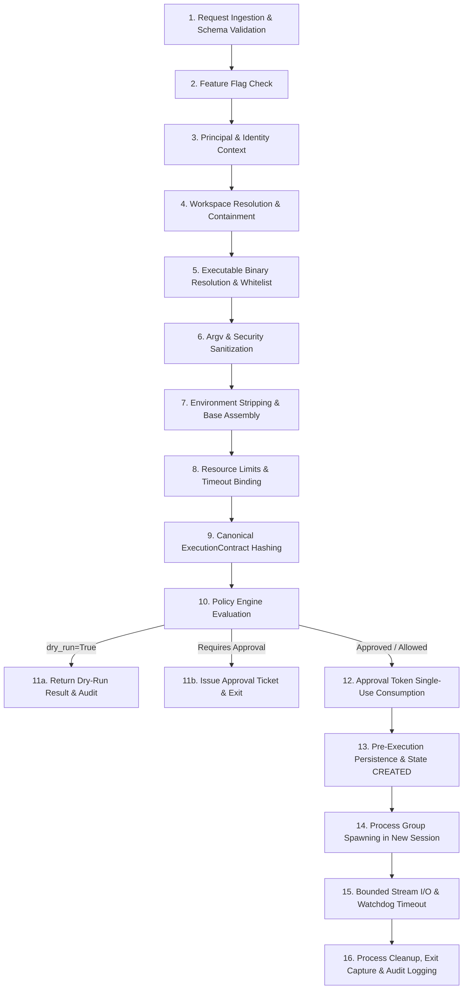
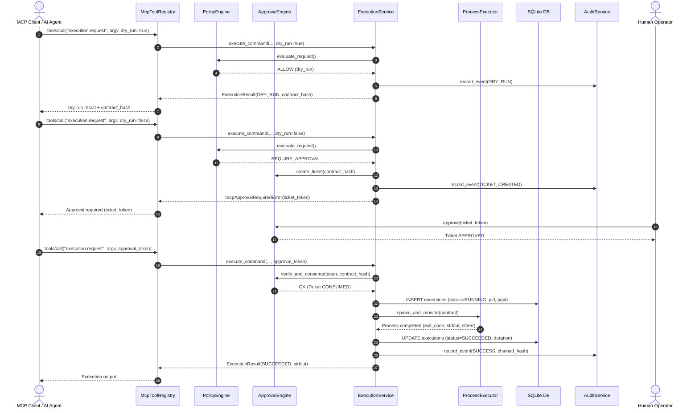

# TACP Execution Design Specification
## Authoritative Architecture for Controlled OS Process Execution

- **Standard:** TACP-SPEC-004-EXEC
- **Status:** APPROVED ARCHITECTURAL SPECIFICATION (GATE A)
- **Phase:** Phase 4 — Controlled Command Execution
- **Audience:** Core Systems Engineering, Security Auditors, AI Integrators

---

## 1. Architectural Philosophy & Non-Negotiable Axioms

The introduction of operating-system process execution marks a critical boundary transition in TACP. While filesystem patches modify text files under optimistic concurrency and rollback mechanisms, process execution invokes the underlying Linux/Android kernel directly.

### Non-Negotiable Axioms:
1. **Zero Shell Strings:** TACP shall **never** expose `shell=True`, `bash -c`, `/bin/sh -c`, `os.system()`, or string-based command lines to AI agents. All executions are strictly parameterized as `executable: str` and `argv: List[str]`.
2. **One Governed Pipeline:** All execution requests—regardless of whether initiated via CLI, MCP, or local automation—must traverse the exact same authoritative 16-stage execution pipeline. There are no bypass functions.
3. **No Unchecked Inheritance:** Child processes do **not** inherit arbitrary parent environment variables, secrets, open file descriptors, or process groups.
4. **Bounded Output & Execution:** Every execution is constrained by hard byte caps on stdout/stderr and a non-negotiable watchdog timeout. Infinite execution is architecturally forbidden.
5. **Human Supremacy & Single-Use Approval:** Execution commands require explicit cryptographic human approval tickets bound to the canonical contract hash. Approvals cannot be reused, replayed, or transferred across workspaces or arguments.

---

## 2. The 16-Stage Governed Execution Pipeline

### Stage 1: Request Ingestion & Schema Validation
The caller provides:
- `workspace_id: str`
- `executable: str` (e.g. `printf`, `/system/bin/echo`, or relative path in workspace)
- `argv: List[str]` (strict array of string arguments, not a combined command line)
- `cwd: Optional[str]` (relative subpath within the workspace, defaults to workspace root)
- `environment: Optional[Dict[str, str]]` (optional explicitly allowed variables)
- `timeout_seconds: Optional[int]` (requested timeout, capped by system limit)
- `dry_run: bool` (default `False`)
- `approval_token: Optional[str]` (required for non-dry-run execution)

Input validation rejects non-string elements, oversized argument arrays (> 64 arguments), oversized individual arguments (> 4096 bytes), and invalid types.

### Stage 2: Feature Flag Check
Checks `config.execution_enabled`. If `False`, immediately returns `TacpSecurityError(ErrorCode.POLICY_DENIED, "Command execution is disabled in TACP configuration")`. Migrations and runtime defaults never enable this flag silently.

### Stage 3: Principal & Identity Context
Resolves caller `Principal`. Verifies `PrincipalType`, `TrustTier`, and `CredentialSource`. Agents (`PrincipalType.AGENT`, `TrustTier.RESTRICTED`) cannot execute commands without human approval. Callers claiming elevated status must provide verified credentials.

### Stage 4: Workspace Resolution & Containment
Resolves active workspace. Verifies workspace status is `ACTIVE`. Canonicalizes working directory `cwd = (workspace.root / req.cwd).resolve()`. Verifies that `cwd` is strictly imprisoned within `workspace.root` via `Path.is_relative_to()`. If `cwd` does not exist or escapes, reject immediately.

### Stage 5: Executable Binary Resolution & Whitelist
Deterministically resolves the target binary:
1. Rejects metacharacters, directory traversal (`..`), and null bytes in the executable name.
2. If executable is an absolute path, verifies it exists in approved system locations (e.g. `/data/data/com.termux/files/usr/bin`, `/system/bin`) or within the workspace.
3. If executable is a bare name, resolves against a strictly curated `SAFE_PATH` (`/data/data/com.termux/files/usr/bin:/system/bin`), never an untrusted user `PATH`.
4. Rejects symlinks pointing outside permitted boundaries or to interpreters (`python`, `bash`, `sh`, `node`, `ruby`, `perl`) in this initial vertical slice.
5. Verifies executable file permissions (`os.X_OK`).

### Stage 6: Argv & Security Sanitization
Inspects argument vector `argv`:
1. Rejects shell injection patterns (semicolons, pipes, backticks, `$(...)`, command substitutions).
2. Verifies argument counts and individual argument byte lengths against `OutputLimits`.
3. Verifies no argument attempts to invoke sub-shells or interpreter evaluation flags (`-c`, `-e`, `--eval`).

### Stage 7: Environment Stripping & Base Assembly
Constructs an isolated, minimal process environment:
- Starts with **BASE SAFE ENVIRONMENT**:
  - `PATH`: Curated minimal system PATH (`/data/data/com.termux/files/usr/bin:/system/bin`)
  - `HOME`: Workspace root or safe sandbox directory
  - `TMPDIR`: Safe sandbox temporary directory
  - `TERM`: `dumb`
  - `LANG`: `C.UTF-8`
- Strips all parent environment variables, especially:
  - Sensitive tokens: `TACP_*`, `AWS_*`, `OPENAI_*`, `ANTHROPIC_*`, `GITHUB_*`, `KEY*`, `SECRET*`, `TOKEN*`
  - Dynamic linkers: `LD_LIBRARY_PATH`, `LD_PRELOAD`
  - Language loader paths: `PYTHONPATH`, `PYTHONHOME`, `NODE_PATH`, `PERL5LIB`, `RUBYLIB`, `CLASSPATH`
  - Git execution helpers: `GIT_CONFIG*`, `GIT_SSH*`, `GIT_ASKPASS`
- Merges caller-supplied `environment` only if keys are in an approved safe whitelist and contain safe values.

### Stage 8: Resource Limits & Timeout Binding
Calculates effective execution constraints:
- `timeout_seconds`: `min(req.timeout_seconds or default, OutputLimits.max_execution_duration_seconds)` (default 15s, hard cap 60s).
- `max_stdout_bytes`: `OutputLimits.max_stdout_bytes` (64 KB).
- `max_stderr_bytes`: `OutputLimits.max_stderr_bytes` (64 KB).

### Stage 9: Canonical ExecutionContract Hashing
Constructs immutable `ExecutionContract` dataclass and computes canonical SHA-256 hash:
$$H_{contract} = \text{SHA256}(\text{canonical\_json}(\text{contract\_dict}))$$
The hash deterministically seals: `executable`, `argv`, `cwd`, `environment`, `network_enabled`, `workspace_id`, and `timeout_seconds`. Any modification invalidates the hash.

### Stage 10: Policy Engine Evaluation
Passes `ExecutionContract` and `RequestContext` to `PolicyEngine.evaluate_request`:
- Evaluates command classification (`SAFE`, `CONTROLLED`, `DANGEROUS`, `CRITICAL`).
- Checks network policy (default DENY).
- Checks approval requirements.

### Stage 11a / 11b: Dry-Run vs Approval Gate
- **If `dry_run=True`:** Formulates `ExecutionResult(status=ExecutionStatus.DRY_RUN)` containing resolved binary, sanitized argv, environment summary, policy decision, and estimated limits. Logs audit event. **Does NOT spawn any process.** Returns result.
- **If non-dry-run and no approval provided:** Generates pending `ApprovalTicket` bound to $H_{contract}$, logs audit event, and raises `TacpApprovalRequiredError` with ticket token and instructions.

### Stage 12: Approval Token Single-Use Consumption
If approval token provided:
- Validates ticket exists, is `STATUS_APPROVED`, has not expired, matches `workspace_id`, matches `executable`, and matches $H_{contract}$ exactly.
- Atomically transitions ticket status to `STATUS_CONSUMED` inside SQLite write transaction.

### Stage 13: Pre-Execution Persistence
Generates `execution_id = "exec-" + uuid.uuid4().hex[:12]`. Inserts record into `executions` table with status `CREATED`, timestamps, contract hash, and parameters.

### Stage 14: Process Group Spawning in New Session
Spawns process via `ProcessExecutor`:
- Invokes `subprocess.Popen(argv, executable=resolved_bin, cwd=cwd, env=clean_env, shell=False, start_new_session=True, stdin=subprocess.DEVNULL, stdout=subprocess.PIPE, stderr=subprocess.PIPE, close_fds=True)`.
- `start_new_session=True` calls `os.setsid()`, placing the child in a distinct process group (`PGID = PID`). This guarantees that descendants spawned by the child share this PGID and can be terminated collectively.
- Updates database record with `PID`, `PGID`, and status `RUNNING`.

### Stage 15: Bounded Stream I/O & Watchdog Timeout
Monitors execution with bounded read buffers:
- Reads stdout and stderr up to byte limits. If output exceeds limit, stops reading, sets `truncated=True`, and terminates process if configured.
- Runs asynchronous timer or selector loop. If elapsed time exceeds `timeout_seconds`, initiates termination sequence.

### Stage 16: Process Cleanup, Exit Capture & Audit Logging
- When process completes or times out:
  - If timeout or cancel: sends `SIGTERM` to process group (`os.killpg(pgid, signal.SIGTERM)`). Waits 1.5s grace period. If still alive, sends `SIGKILL` (`os.killpg(pgid, signal.SIGKILL)`).
  - Sanitizes output streams: strips ANSI terminal escapes, null bytes, and control characters to prevent terminal injection.
  - Updates `executions` database table with final status (`SUCCEEDED`, `FAILED`, `TIMED_OUT`, `CANCELLED`), exit code, signal, duration, and output byte counts.
  - Emits immutable `AuditEvent` chained to the cryptographic audit log.
  - Returns `ExecutionResult` to caller.

---

## 3. Subsystem Interaction Model

---

## 4. Verification & Validation Contract

To clear Gate A and Gate B, the execution engine must pass:
1. 100% of existing 470 tests without regression.
2. 100+ execution security tests covering all Part 51 attack vectors.
3. Multi-threaded concurrency tests on audit and approval engines.
4. Physical Termux validation on Android 13/aarch64.
