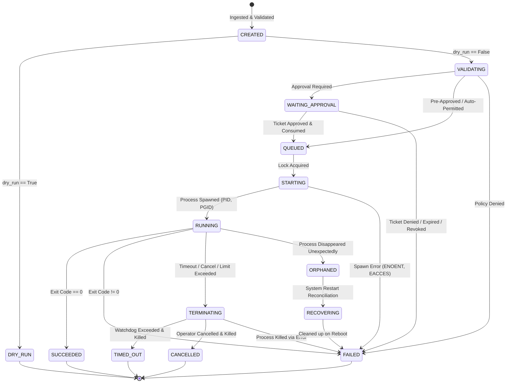

# TACP Execution State Machine Specification
## Formal Lifecycle States, Invariants & Transition Rules

- **Standard:** TACP-SPEC-004-STATE
- **Status:** APPROVED SPECIFICATION (GATE A)
- **Phase:** Phase 4 — Controlled Command Execution

---

## 1. Formal Execution Lifecycle States

Every execution entity managed by TACP is governed by a finite state machine (FSM). The state is persisted durably in the `executions` SQLite table.

---

## 2. State Definitions

| State | Description | Can Transition To |
| :--- | :--- | :--- |
| **`CREATED`** | Request received, schema validated, contract hash computed. | `DRY_RUN`, `VALIDATING`, `FAILED` |
| **`DRY_RUN`** | Terminal pseudo-state: dry-run results returned; no process launched. | Terminal |
| **`VALIDATING`** | Active policy inspection, executable resolution, workspace jailing. | `WAITING_APPROVAL`, `QUEUED`, `FAILED` |
| **`WAITING_APPROVAL`** | Policy requires human approval. Ticket token issued. | `QUEUED`, `FAILED` |
| **`QUEUED`** | Approved or pre-authorized; awaiting execution slot / lock. | `STARTING`, `CANCELLED`, `FAILED` |
| **`STARTING`** | Acquiring process group session (`setsid`), configuring pipes. | `RUNNING`, `FAILED` |
| **`RUNNING`** | Active process group executing under watchdog supervision. | `SUCCEEDED`, `FAILED`, `TERMINATING`, `ORPHANED` |
| **`TERMINATING`** | Signal escalation active (`SIGTERM` -> grace period -> `SIGKILL`). | `TIMED_OUT`, `CANCELLED`, `FAILED` |
| **`SUCCEEDED`** | Process exited normally with exit code 0. | Terminal |
| **`FAILED`** | Policy violation, invalid input, spawn error, or exit code != 0. | Terminal |
| **`TIMED_OUT`** | Execution duration exceeded configured timeout and was killed. | Terminal |
| **`CANCELLED`** | Manually cancelled by authorized operator or principal. | Terminal |
| **`ORPHANED`** | System crashed or supervisor lost connection while process was running. | `RECOVERING` |
| **`RECOVERING`** | Startup reconciliation actively inspecting PID / stat tables. | `FAILED`, `CANCELLED` |

---

## 3. Forbidden Transitions & Invariants

1. **No Resurrection:** Once in a terminal state (`SUCCEEDED`, `FAILED`, `TIMED_OUT`, `CANCELLED`, `DRY_RUN`), an execution can **never** transition to any other state.
2. **No Unapproved Execution:** Transition from `WAITING_APPROVAL` to `STARTING` or `RUNNING` without passing through atomic ticket consumption in `QUEUED` is strictly forbidden.
3. **No Phantom Processes:** A process cannot enter `RUNNING` without a valid recorded PID and PGID.
4. **Deterministic Exit Codes:** An execution cannot transition to `SUCCEEDED` if `exit_code != 0` or if terminated by a signal.
