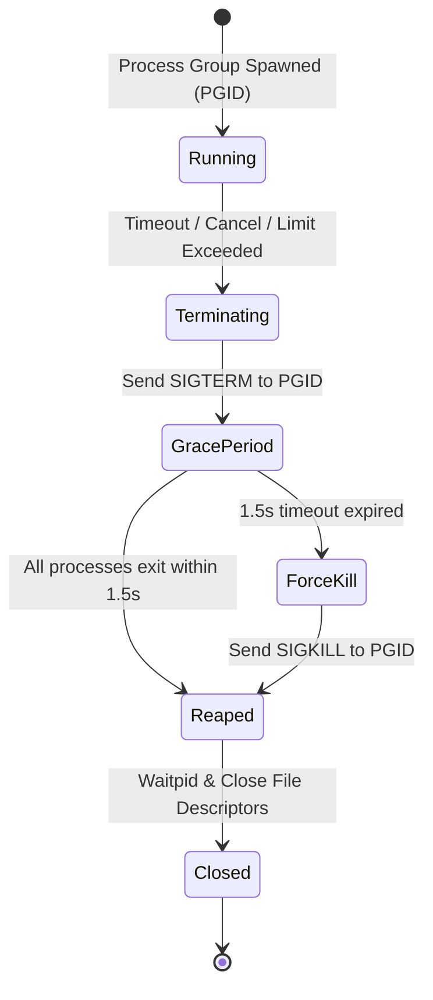

# TACP Process Model Specification
## Process Groups, Signal Escalation, Ownership & PID Lifecycle

- **Standard:** TACP-SPEC-004-PROCESS
- **Status:** APPROVED SPECIFICATION (GATE A)
- **Phase:** Phase 4 — Controlled Command Execution
- **Target OS:** Linux 5.15+ (Termux / Android aarch64)

---

## 1. The Child Process Hierarchy Problem

In POSIX operating systems, when a parent process spawns a child, that child may fork and spawn its own children (descendants/grandchildren). If the supervisor only maintains a reference to the direct child's Process ID (PID) and issues `kill(pid, SIGTERM)`, the direct child terminates, but any detached descendants are reparented to `init` (PID 1 or Android `zygote`/`init`) and continue running as orphaned background processes.

In an AI control plane, this presents an unacceptable hazard:
- A command could accidentally or maliciously spawn long-running miners, listeners, or loopers that persist undetected.
- Timeout mechanisms that only kill the parent leave background workloads consuming CPU, battery, and memory indefinitely.

```
VULNERABLE MODEL (PID-ONLY KILL):
[TACP] --- spawns ---> [Direct Child (PID 100)] --- forks ---> [Grandchild (PID 101)]
  |                                                                   |
  +--- kills PID 100 ---> (PID 100 exits)                            |
                                      [Grandchild (PID 101)] PERSISTS AS ORPHAN!

GOVERNED MODEL (PROCESS GROUP PGID):
[TACP] --- setsid() ---> [Session & Group Leader (PGID 100, PID 100)]
                               |
                               +--- forks ---> [Grandchild (PGID 100, PID 101)]
  |
  +--- killpg(PGID 100, SIGTERM/SIGKILL) ---> ENTIRE PROCESS TREE TERMINATED!
```

---

## 2. Process Group Isolation via `start_new_session=True`

To guarantee complete process tree control, TACP mandates that **every** spawned process is initialized with `start_new_session=True` in Python `subprocess.Popen`:

```python
process = subprocess.Popen(
    args=contract.argv,
    executable=contract.executable,
    cwd=contract.cwd,
    env=env,
    shell=False,
    start_new_session=True,  # Calls os.setsid() in child before exec
    stdin=subprocess.DEVNULL,  # No interactive TTY
    stdout=subprocess.PIPE,
    stderr=subprocess.PIPE,
    close_fds=True,  # No leaking TACP file descriptors
)
pgid = os.getpgid(process.pid)  # Guaranteed == process.pid
```

### Technical Invariants of `start_new_session=True`:
1. `os.setsid()` creates a new session and sets the child process as both the session leader and the process group leader (`PGID == PID`).
2. Any subsequent process created by this child (`fork()`, `vfork()`, `clone()`, `posix_spawn()`) inherits this same `PGID` unless it explicitly calls `setsid()` itself.
3. Sending a signal to the process group via `os.killpg(pgid, sig)` sends the signal to **every** process in the group simultaneously.

---

## 3. Signal Escalation & Graceful Termination Protocol

When an execution completes normally, terminates due to timeout, or is cancelled by an operator, TACP applies an authoritative two-stage termination sequence:



### Step 1: Graceful Termination (`SIGTERM`)
- TACP sends `SIGTERM` to the entire process group:
  ```python
  try:
      os.killpg(pgid, signal.SIGTERM)
  except ProcessLookupError:
      pass  # Process group already terminated
```
- A 1.5-second grace period is observed using non-blocking polling (`poll()` / `select`).

### Step 2: Unconditional Force Termination (`SIGKILL`)
- If any process in the group remains alive after the grace period, TACP sends `SIGKILL`:
  ```python
  try:
      os.killpg(pgid, signal.SIGKILL)
  except ProcessLookupError:
      pass
```
- In POSIX, `SIGKILL` cannot be caught, blocked, or ignored. The kernel immediately destroys the process group.

### Step 3: Zombie Reaping & Descriptor Closure
- TACP immediately calls `process.wait()` (or `os.waitpid`) to reap zombie entries from the OS process table.
- Standard file descriptors (`stdout`, `stderr`) are closed to release kernel pipe buffers.

---

## 4. PID Reuse & Collision Defense

In Linux, Process IDs are integers ranging from 1 to 32768 (or `sysctl kernel.pid_max`). Under heavy load, PIDs are recycled quickly.

### The Attack Vector:
1. TACP spawns PID 15200.
2. PID 15200 exits rapidly.
3. Another unrelated user process or background app is assigned PID 15200 by the kernel.
4. TACP's watchdog timer fires, issuing `os.killpg(15200, SIGKILL)`, accidentally terminating an innocent process!

### Defensive Measures in TACP:
1. **Process Handle Retention:** The `subprocess.Popen` object retains an open file descriptor or handle to the child. Calling `process.poll()` or `process.wait()` determines if the direct child has already exited.
2. **Pre-Signal Verification:** Before sending `os.killpg(pgid, signal)`, TACP checks:
   - Does `process.poll()` return `None` (child still alive)? If not `None`, the direct child has already completed and was reaped.
   - For orphan cleanup, verify `/proc/<pid>/stat` start time (`starttime` field in column 22) against the start time recorded in the `executions` database. If the process start time differs from the recorded start time, PID recycling has occurred and TACP **must not** signal the process.

---

## 5. Process Ownership & State Tracking

Every process executed by TACP is registered in the `executions` table with:
- `execution_id`: Unique identifier (e.g. `exec-4f8a29b01c3e`)
- `pid`: Direct child process ID
- `pgid`: Process group ID
- `principal_id`: Caller principal
- `workspace_id`: Active workspace
- `started_at`: ISO-8601 UTC timestamp
- `start_time_ticks`: Kernel clock ticks from `/proc/<pid>/stat` (when available)

TACP never signals any process that lacks a verified, active ownership record in its database.
